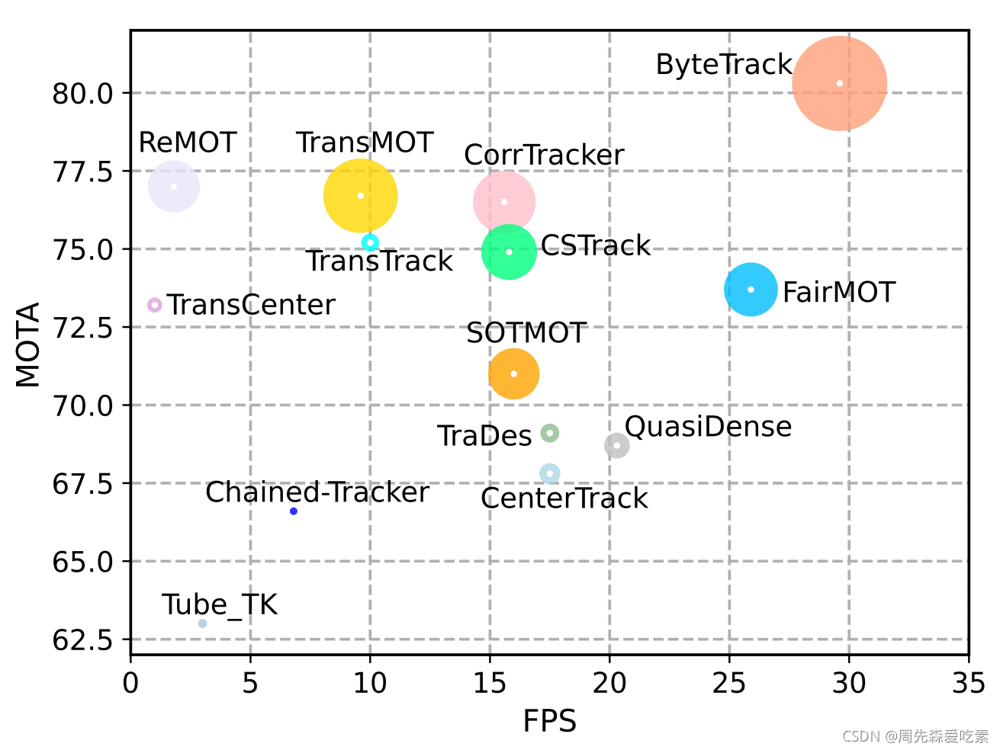

# ByteTrack + Person_feature_extracter

## Introduction

本仓库主要目的是对视频中的行人进行跟踪+行人特征提取

主要包括两个算法：1）跟踪算法；2）行人特征提取算法

跟踪算法使用了ByteTrack，行人特征提取算法用了经过蒸馏的resnet34

ByteTrack：是2021年公开的多目标跟踪算法，第一次在MOT17数据集上到达80以上的MOTA，并在多个榜单上排名第一，堪称屠榜多目标跟踪。

ByteTrack的性能比较如下图，横轴表示推理速度、纵轴表示MOTA精度，圈的大小表示IDF1的数值。

可以看到，ByteTrack超越了此前所有的跟踪方法。



相关论文：https://arxiv.org/abs/2110.06864


## How to start

环境配置: 见requirements.txt


## How to use

**you can use it as submodule**

在自己的项目目录下，git submodule add  https://gitlab.ictidei.cn/band-intel-center/Algorithm-platform/bytetrack.git

便会在项目目录下下载到bytetrack相关代码

下载完成后，便可在自己项目中使用bytetrack API，**使用样例和输入输出说明**如下：

```python
import torch
from bytetrack.src.deep_reid import DeepReid

device = torch.device('cuda:0' if torch.cuda.is_available() else 'cpu')
mot = DeepReid(extractor_config="./bytetrack/src/configs/config-test.yaml",
        	   extractor_weights="./bytetrack/src/weights/model_final.pth",
        	   tracker_config="./bytetrack/src/configs/tracker.yaml",
        	   device=device)

mot_pred, added_track_ids = mot.update(bbox_xyxy=detection_results_bboxs,
    								   confidences=detection_results_confidences,
    								   ori_img=frame_bgr)
# API inputs    								  
    # bbox_xyxy: results of bbox from human detector, xyxy, numpy.ndarray, (N, 4)
    # confidences: results of confidences from human detector, numpy.ndarray, (N,)
    # ori_img: bgr image corresponding to detection results

# API outputs
    # mot_pred, dict, 
        # key: track id, int
        # value: 对应track id的相关信息, dict, 具体包含以下信息，
        # {"bbox": 对应track id的bbox, numpy.ndarray, xyxy,
        #  "confidence": 对应bbox的置信度, float,
        #  "feature": 对应bbox用resnet34提取的行人特征, 512维, numpy.ndarray,
        #  "person_img": 基于bbox crop的行人图像,}
    # added_track_ids, list,
    	# 每个元素为基于上一帧图像新增的track id
```

